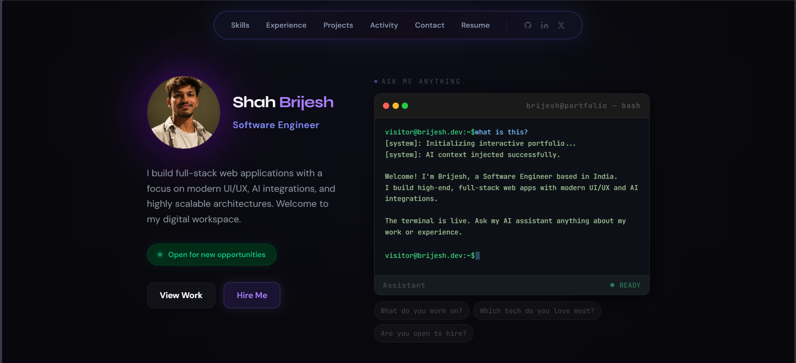

# 🌌 Dark Luxury Portfolio



A premium, highly-interactive developer portfolio built with Next.js, React, and Tailwind CSS. Designed with a "Dark Luxury" aesthetic to showcase technical projects, skills, and professional experience with sophisticated animations and modern typography.

## ✨ Features

- **Modern Tech Stack**: Built with [Next.js](https://nextjs.org/) (App Router), React, and [Tailwind CSS](https://tailwindcss.com/).
- **Dark Luxury Aesthetic**: Deep, sophisticated color palettes with glassmorphism, subtle gradients, and smooth transitions.
- **Dynamic Animations**: Fluid micro-interactions and scroll animations.
- **Fully Responsive**: Optimized for seamless viewing across all devices (mobile, tablet, and desktop).
- **Interactive Components**: Features a dynamic Navbar, interactive Project cards, and an integrated resume download.
- **SEO Optimized**: Built-in best practices for metadata and web vitals.

## 🚀 Quick Start

First, install the dependencies:

```bash
npm install
# or
yarn install
# or
pnpm install
```

Then, run the development server:

```bash
npm run dev
# or
yarn dev
# or
pnpm dev
```

Open [http://localhost:3000](http://localhost:3000) with your browser to see the portfolio.

## 📂 Project Structure

- `app/` - Next.js App Router files (pages, layout, globals.css)
- `Components/` - Reusable UI components (Navbar, Hero, Projects, Experience, Skills, etc.)
- `public/` - Static assets like images and the downloadable Resume PDF.

## 🛠️ Customization

To personalize this portfolio:
1. **Resume**: Replace `public/Brijesh_Shah_Resume_final.pdf` with your own.
2. **Data**: Update the sections inside the `Components/` folder to reflect your own skills, projects, and work experience.
3. **Environment**: Add necessary environment variables in `.env.local` if you are integrating external APIs.

## 📄 License

This project is licensed under the MIT License - see the [LICENSE](LICENSE) file for details.
